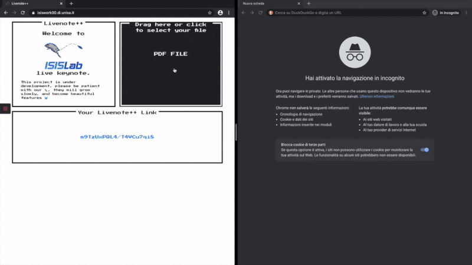

# Livenote++

## Table of contents
* [Introduction](#Introduction)
  * [Features](#Features)
  * [Technologies](#Technologies)
* [Contributing and development](#Contributing-and-development)
  * [Installation](#Installation)
  * [How to run on your local environment?](#How-to-run-on-your-local-environment?)
* [License](#License)

# Introduction

Livenote++ is an Open Source tool that could help people to deliver lessons and webinar in a fast and scalable way.
The idea was born during the spread of Covid-19. We were looking for a FOSS that could be used by university's teachers to provide regular lessons to the students. Any platform that we've tried had subscrition fees for the Pro functionalities, or had problems about unstable connection, error and bug on high volume of clients and so on. So, like good programmers, we've started to build our own platform.

## What's Livenote++ for aim?

The aim of Livenote++ is to manage lesson/seminars from one person to a large number of spectators, but leaving them the possibility to interact with some tools. The main principle for this project is to have a lightweight platform to present a keynote or some slides. We've achieved this goal mixing some technologies -listed below- reducing the impact of communications or streaming between the clients.



## Features

For now, the project is full supported on Desktop browser (Chrome 37+, Opera 24+, Firefox54+)

* :zap: Stateless -no personal informations are stored-
* :fire: LoadAndPlay -load your pdf and start your presentation-
* :rocket: Streaming audio and video for the presenter
  * If you don't want to share your webcam, you can use an adorable pokemon as a placeholder!
* :sparkles: Live chat with your spectators
* :tada: Create Real time poll
* :pencil2: Draw on your slides with your mouse
  * You can also change the color and the width of the drawings!

## Technologies

We made Livenote using the following tools:

Backend:
* 
* 
* 
* 
* 

:mag: If you have problems with TURN server for the RTCconnection, follow this [guide](https://webrtc.org/getting-started/turn-server)

Frontend:
* 
* 
* 

# Contributing and Development

## Installation

Start using Node

:see_no_evil: Remember to change the certificate for https and the address of stun server with your own

```bash
# Install dependencies for server
npm install

# Start turn on the machine where should run
systemctl start coturn

# Run the server
node server
```

Start using Docker

```bash
# Building the image
docker build --tag livenote++ .

# Run the image in a container
docker run -d -p 433:433 livenote++
```

## How to run on your local environment?

If you want to run this project in local (no https), you can apply this changes to the code in server.js

```js
// Change port to 8080 or one free of your choice
const port = 8080;
// Change instance of server to http instead of https
const server = http.createServer({ 
},app);
```

:beers: Enter in our discord community for suggestions and/or help 
<a href="https://discord.gg/BTt5fUp"></a>

# License
[](https://lbesson.mit-license.org/) 

This project is licensed under the MIT License - see the [LICENSE.md](LICENSE) file for details
