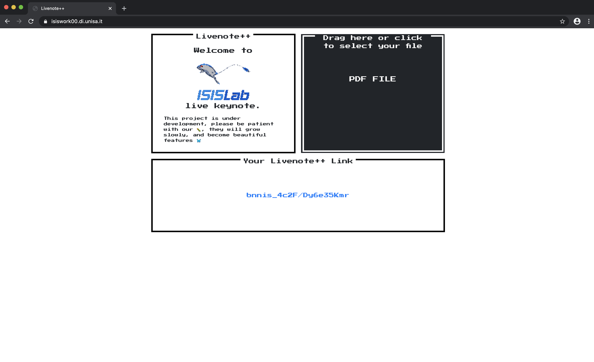
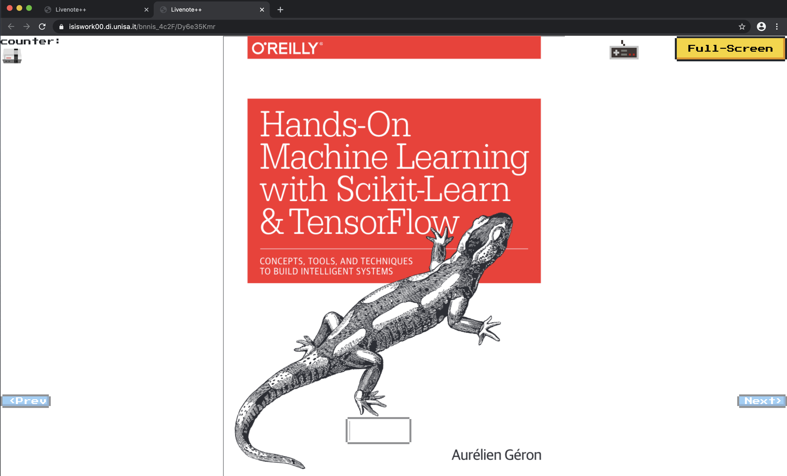

# Livenote++

## Table of contents
* [Introduction](#Introduction)
* [Feature](#Feature)
* [Technologies](#Technologies)
* [Setup](#Setup)
* [Local project](#Local-project)
* [License](#License)

## Introduction

Livenote is an Open Source tool that could help teachers to deliver lessons and webinar in a fast and scalable way.
The core libraries are:
Backend:
* 
* 

Frontend:
* 

For now, the project is full supported for Chrome

Enter in our discord channel for suggestion or help:
[Discord](https://discord.gg/BTt5fUp) 

gif delle immagini

Here is the index view. You can drag and drop your pdf file into the box, a link will be generated for your presentation!


This is the master view with all the possible commands at your hands!


## Feature

working on progress

## Technologies

working on progress

## Contributing and Development

## Setup

Start using Node

Remember to change the certificate for https and the address of stun server

```bash
# Install dependencies for server
npm install

# Start turn
systemctl start coturn

# Run the server
node server
```

Start using Docker

```bash
# Building the image
docker build --tag livenote++ .

# Run the image in a container
docker run -d -p 433:433 livenote++
```

## Run locally

To run this project in local (no https), apply this changes to the code in server.js

```js
// Change port to 8080 or one free of your choice
const port = 8080;
// Change instance of server to http
const server = http.createServer({ 
},app);
```

## License

This project is licensed under the MIT License - see the [LICENSE.md](LICENSE) file for details